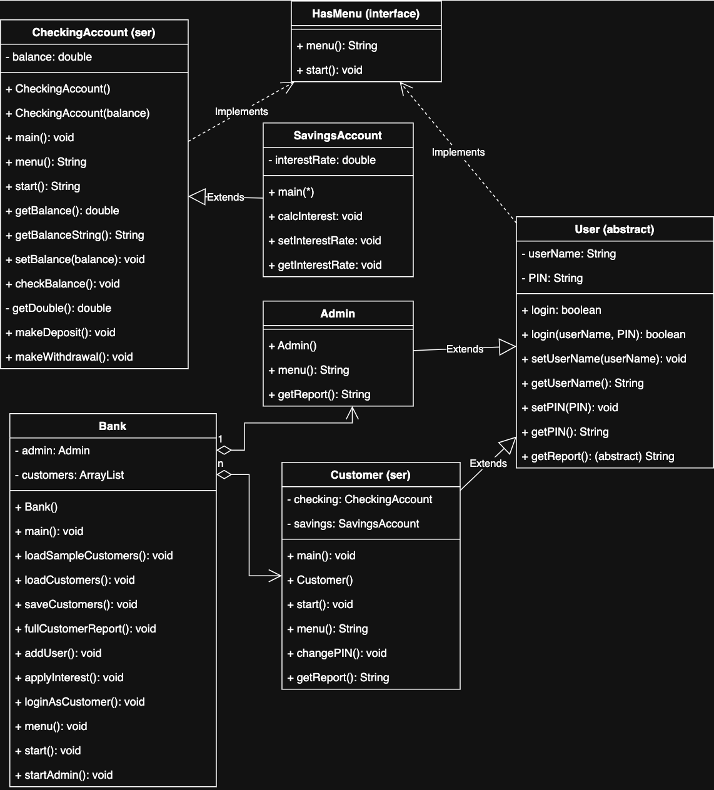

# Bank-on-it
ATM 


 ## HasMenu

 An interface for menuing.  
 Will created the Scanner object input here since it will be used repeatedly.  
 Contains a menu method that returns a string.  
 Contains another method, start, that will function based off of the string value that menu returns.  

 ## CheckingAccount
	

```
public class CheckingAccount implemenets HasMenu, Serializable
---------------------------------------------------------------
private double balance
---------------------------------------------------------------
void main();
CheckingAccount();
CheckingAccount(double balance);
String menu();
void start();
double getBalance();
String getBalanceString();
double getDouble();
void setBalance();
void checkBalance();
void makeDeposit();
void makeWithdrawa();
```
main() creates new CheckingAccount object.  

void start will call menu and return the user input. Based on the returned input, different methods will be called.   
1 - checkBalance: print out current balance in account.  
2 - makeDeposit: only make a deposit if greater than 0.  
3 - makeWithdrawal: only make a withdrawal if greater than 0 and less than current balance.  
0 - exit. 

We have multiple ways to get the balance.  
getBalance: return a double.  
getBalanceString: return a String using String.format to print out with "$" and 2 decimal places. Easier for report generation.  

getDouble: verify legal user input. If not a legal input, defaults to 0.00.  

setBalance: a setter to properly access private attributes.  

## SavingsAccount

```
public class SavingsAccount extends CheckingAccount
---------------------------------------------------
private double interestRate
---------------------------------------------------
void main();
SavingsAccount();
SavingsAccount(double balance);
void setInterestRate;
double getInterestRate;
void calcInterest; 
```
SavingsAccount inherits from CheckingAccount.  

main() creates new SavingsAccount object.  

SavingsAccount() defaults to 0.05d interestRate and setBalance(0).  

SavingsAccount(double balance) defaults interestRate to 0.05d and setBalance(balance).  

setInterestRate() takes String input, with a try catch statement. If valid input, sets interest to input, otherwise default to 0.05 interestRate.  

getInterestRate() returns a double value.  

calcInterest() takes current balance in SavingsAccount and applies the current interest rate, then from CheckingAccount inheretence, update balance with setBalance.  

## User(abstract)
```
public abstract class User implements HasMenu, Serializable
-------------------------------------------------
private String userName;
private String PIN;
-------------------------------------------------
boolean login();
boolean loginARGS();
void setUserName();
String getUserName();
void setPIN();
String getPIN();
abstract String getReport();
```

login() prompts for userName and PIN, then passes inputs to loginARGS(), returns a boolean.  

loginARGS() checks if userName equals inputUserName AND PIN equals inputPIN. returns a boolean.  

setUserName() is a setter for userName.  

getUserName() returns String userName.  

setPIN() is a setter for PIN. 

getPIN() returns String PIN.

abstract String getReport() is abstract used in Customer and Admin that must return a String.  

## Customer
```
oublic class Customer extends User implements Serializable
-------------------------------------------------
protected CheckingAccount checking // protected bc we'll reference it
protected SavingsAccount savings // protected bc we'll reference it
-------------------------------------------------
void main();
Customer();
Customer(String userName, String PIN);
String menu();
void start();
void changePIN();
String getReport();
```

main() creates new Customer object.  
Customer() defaults attritbutes to empty containers and initializes a new CheckingAccount and SavingsAccount object.  

Customer(String userName, String PIN) takes String arguments for userName and PIN, then creates a new CheckingAccount and SavingsAccount object.  

menu() prompts for input of 0-3 and then returns a String of that input.

start() calls the menu() method, and based on what is returned will call other methods.  
1 - this.checking.start(): CheckingAccount start() method is called.  
2 - this.savings.start(): SavingsAccount start() method is called.  
3 - this.changePIN: setter for PIN attritubute.
0 - exit. 

changePIN() takes a String input. Then, using regular expressions, checks if the input is valid of being 4 digits and comprised of only numerical characters. If true, sets PIN attribute to input.  

getReport() inhereted from User, returns a String using the getBalanceString() method for both CheckingAccount and SavingAccount.  

## Admin
```
public class Admin extends User
-------------------------------------------------
no attributes
-------------------------------------------------
void main();
Admin();
String menu();
void start();
String getReport();
```
Inherits from User.  

main() initializes new Admin object.  

Admin() uses setters to set userName to "admin" and PIN to "0000".  

menu() prompts for input 0-3, then returns a String of that value.  

start() is left blank, Bank will handle the start() methods.  

getReport() has to be included since Admin inherits User, we just return null to satisfy the abstract requirments.  

## Bank
```
class CustomerList extends ArrayList<Custoner> {};

public class Bank implements HasMenu
-------------------------------------------------
private Admin admin;
private CustomerList customers = new CustomerList();
-------------------------------------------------
void main();
Bank();
void loadSampleCustomers();
void saveCustomers();
void oadCustomers();
void fullCustomerReport();
void addUser();
void addInterest();
void loginAsCustomer();
void start();
String menu()
void adminStart();
```
Most of the work is done in the Bank.  

main() initializes a new Admin object. Also responsible for loadCustomers(), saveCustomers(), and start(). Will also contain loadSampleCustomers() to fill the CustomerList ArrayList.  

loadSampleCustomers() here we use the .add() method from ArrayList to add customers. We add 3 users.  
(User, PIN)  
Alice, 1111  
Bob, 2222  
Cindy, 3333  

Alice will also start with $1000 in her CheckingAccount and SavingsAccount balance. We do this using the setBalance method for each Object instance.  

saveCustomers() is where serialization comes into play. Here we use FileOutputStream to create a new file of "customerArray.dat". Then create a new ObjectOutputStream instance using with the FileOutputStream. We write the CustomerList customers to the ObjectOutputStream then close the both Streams.  

loadCustomers() is the opposite of saveCustomers(). Here we take the "customerArray.dat" and using FileInputStream, create a new instance. Then using ObjectInputStream, create a new instance using the FileInputStream. Close both streams after.  

fullCustomerReport() we iterate throught the CustomerList customers and use the getReport() method from the Customer class to print out the contents of each items balance for both checkings and savings.  

addUser() prompts for inputs for userName and PIN. Using regex, check if PIN is 4 digits and of numeric characters only. If so, created a new Customer instance, and append to the end of customers using the .add() method.  

addInterest() iterates throught customers and uses the calcInterest method from SavingsAccount to apply interest to the savings of each Customer instance. Print out the new savings balance.  

loginAsCustomer() takes userNameIn and pinIN inputs. Initialize a Customer object called currentCustomer as null. Iterate throught customers and call the loginARGS() method from User. If loginARGS returns true, currentCustomer is assigned to that current Customer in the iteration. If loginARGS returns false, and iteration completes, currentCustomer remains null, and print no customer found.  

start() calls the menu() method, and based on what is returned by menu(), calls certain methods.  
1 - Admin login: call admin.login() and if returns true, call adminStart().  
2 - Customer login: call loginAsCustomer().  
0 - Exit.  

menu() prompts for input 0-2 and returns that value.

adminStart() if admin.login() returns true, this is called. Calls admin.menu(), then calls methods based on what is returned.  
1 - this.fullCustomerReport()  
2 - this.addUser()  
3 - this.addInterst()  
0 - Exit.  
This is why start() was left blank in Admin since it was being handled here in Bank.  

